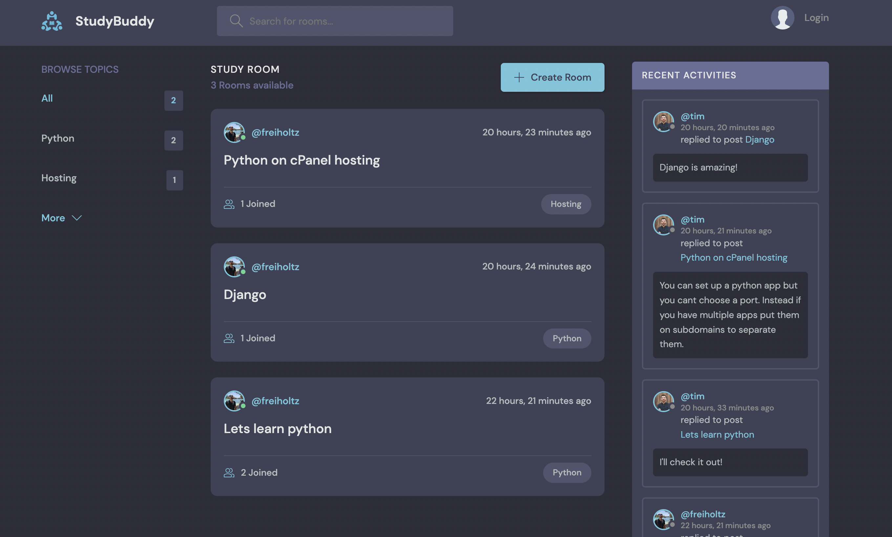
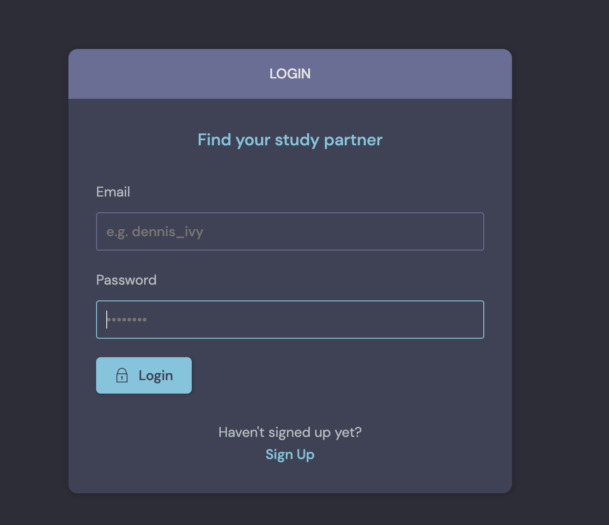
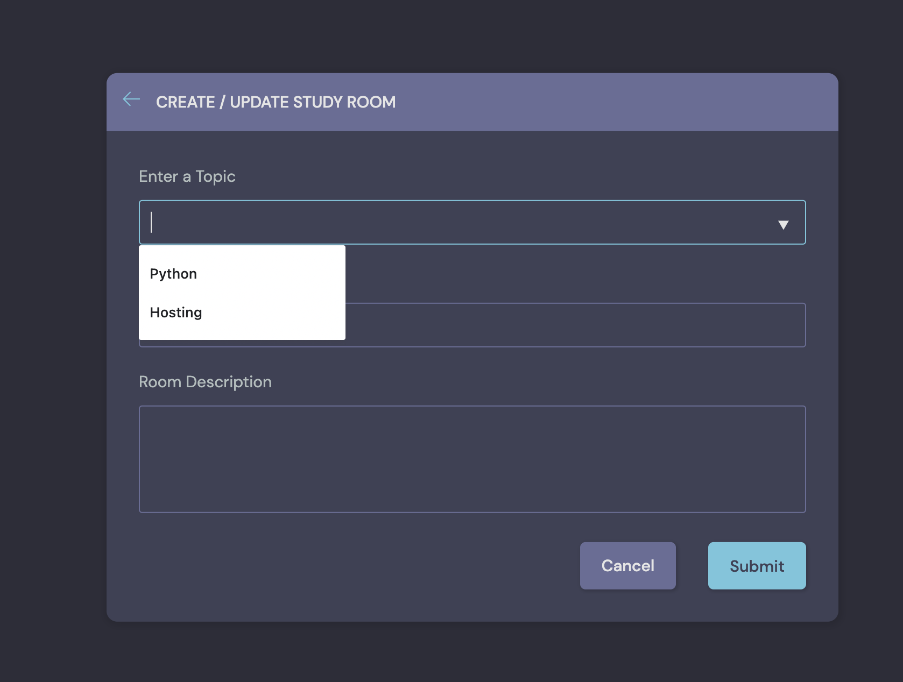
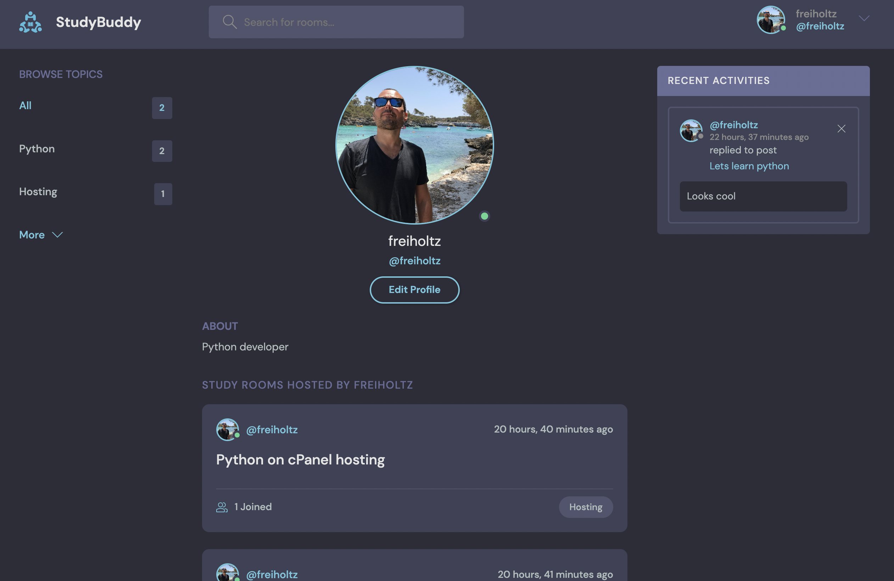
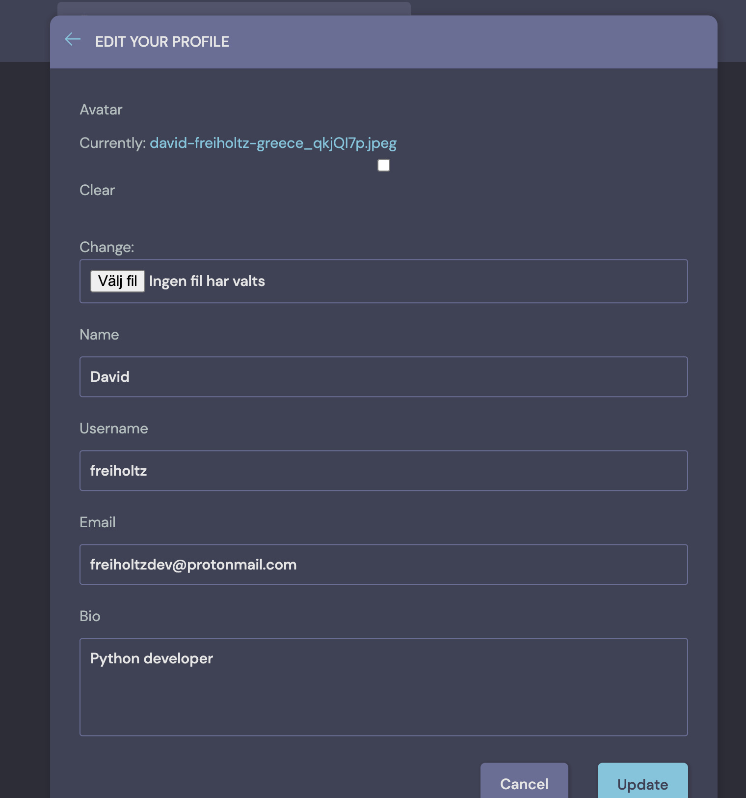
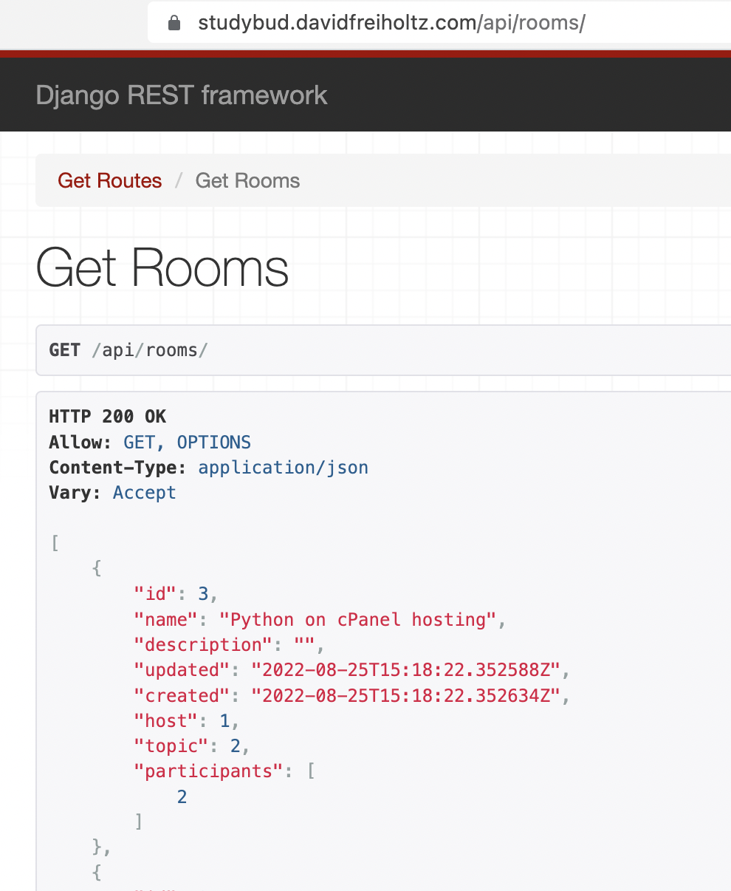

# Django Course "StudyBud"

# A CRUD site with REST API functionality

## I completed this Django course in Aug 2022 and deployed the resulting site on cPanel hosting, [studybud.davidfreiholtz.com](https://studybud.davidfreiholtz.com), that conencts to this GitHub repo and does auto deploy post work with using a [.cpanel.yml](https://github.com/freiholtz/Django-Course-StudyBud/blob/main/.cpanel.yml) file. [API here](studybud.davidfreiholtz.com/api/)

## Keywords

Python, Django, CRUD, REST API, Dev/Prod dynamic settings, VSCode, Terminal, SSH, Linux, cPanel, Deployment.

## Course outline i followed

Created by Dennis Ivy in [this video course](https://www.youtube.com/watch?v=PtQiiknWUcI).

- 00:00 - Intro
- 1:10 - Product Demo
- 4:04 - Prerequisites
- 5:27 - What is Django
- 12:52 - Resources & Environment Setup
- 15:59 - Installation & Setup
- 31:28- Views & URL's
- 39:55 - Templates
- 1:04:25 - Database & Admin Panel
- 1:39:00- CRUD
- 2:06:22 - Search
- 2:22:27 - User Login
- 2:32:25 - Flash Messages
- 2:39:03- User Logout
- 2:41:45 - Restricted Pages
- 2:49:00 - User registration
- 3:01:25 - Chat Room Messages CRUD
- 3:27:30 - Activity Feed
- 3:43:00 - User Profile Page
- 3:53:25- Static Files
- 4:02:15 - Theme Installation
- 5:11:50 - Edit User Account Page
- 5:35:02 - Mobile Responsiveness
- 5:53:00 - Django REST Framework
- 6:25:43 - Customizing User model
- 6:37:35 - Integrating Custom User Model

## Images

1-overview

2-login

3-create

4-profile

5-update

6-api

